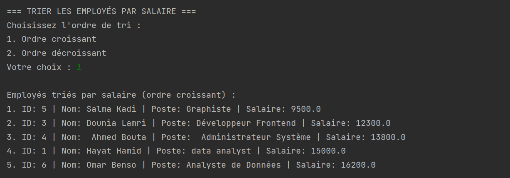

# Application de Gestion des Employés

## Contexte
Cette application Java permet de gérer les employés d'une entreprise en utilisant les concepts de la programmation orientée objet. Elle manipule un tableau d'objets pour stocker et gérer les données des employés.

## Fonctionnalités
1. **Ajouter un employé**: Créer un nouvel objet Employe et l'ajouter au tableau
2. **Modifier un employé**: Mettre à jour les informations d'un employé existant via son ID
3. **Supprimer un employé**: Retirer un employé du tableau grâce à son ID
4. **Afficher la liste des employés**: Afficher tous les employés avec leurs détails
5. **Rechercher un employé**: Trouver un employé par son nom ou son poste
6. **Calculer la masse salariale**: Calculer la somme totale des salaires mensuels
7. **Trier les employés**: Afficher les employés triés par salaire (ordre croissant ou décroissant)

## Structure du code

### Classe `Employe`
- **Attributs privés**:
    - `int id`: Identifiant unique
    - `String nom`: Nom complet
    - `String poste`: Poste occupé
    - `double salaire`: Salaire mensuel
- **Constructeurs**:
    - Un constructeur avec tous les attributs
    - Un constructeur par défaut
- **Méthodes**:
    - Getters et setters pour tous les attributs
    - `toString()`: Affiche les informations complètes d'un employé
    - `compareParSalaire()`: Compare deux employés par leur salaire (méthode statique)

### Classe `GestionEmployes`
- Gère un tableau d'objets `Employe[]` (limité à 50 employés)
- Implémente les méthodes de gestion:
    - `ajouterEmploye()`
    - `modifierEmploye()`
    - `supprimerEmploye()`
    - `afficherEmployes()`
    - `rechercherEmploye()`
    - `calculerMasseSalariale()`
    - `trierEmployesParSalaire()`

### Classe `Main`
- Contient la méthode `main()` et gère l'interface utilisateur
- Affiche le menu et traite les entrées utilisateur
- Appelle les méthodes appropriées de la classe `GestionEmployes`

`

### Exécution

### Menu Principal
Voici un aperçu du menu principal de l'application, où l'utilisateur peut choisir parmi différentes options pour gérer les employés.

### 1. Ajout d'un Employé
L'utilisateur entre les informations pour ajouter un nouvel employé.

### 2. Modifier un employé existant.

### 3. Supprimer un employé du tableau à l’aide de son identifiant.

### 4. Afficher tous les employés avec leurs détails.

### 5. Trouver un employé par son nom ou son poste.

### 6. Calcul de la Masse Salariale
Affichage du calcul de la masse salariale totale des employés présents.

### 7. Tri des Employés par Salaire
Voici un écran montrant les employés triés par salaire, dans l'ordre croissant.

Voici un écran montrant les employés triés par salaire, dans l'ordre décroissant.

## Points techniques notables
- Vérification des contraintes (tableau non plein, ID unique, etc.)
- Utilisation d'un algorithme de tri à bulles pour trier les employés par salaire
- Encapsulation des données avec attributs privés et méthodes d'accès
- Séparation des responsabilités entre les différentes classes
